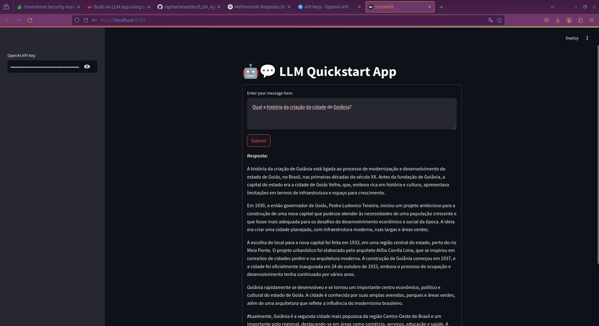

# LLM_App
Este repositório contém uma aplicação interativa desenvolvida com Streamlit e LangChain, permitindo a geração de texto a partir de prompts fornecidos pelo usuário.

Uma pequena visualização de um protótipo que depois irei fazer mais ajustes e deixar mais responsivo e bonito esse chatzinho

